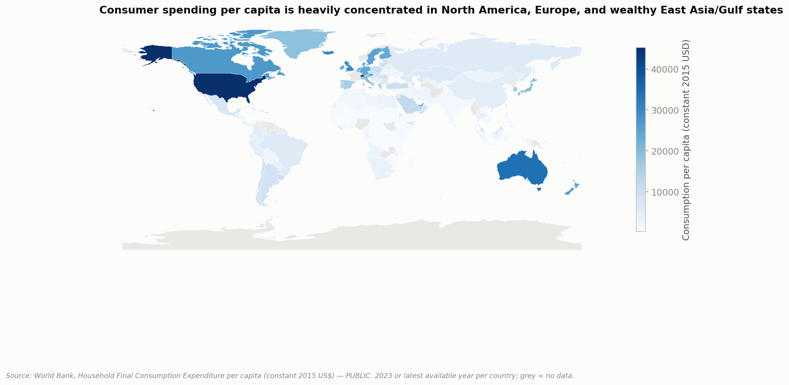

# Project 007: Global Consumer Spending Intelligence



**Part of a [11-case-study portfolio](https://github.com/ooi-darren)**, the first to move beyond a single country into a genuinely global panel.

## Executive Summary

This project builds and analyses a 182-country, 11-year (2013–2023) consumer-spending intelligence panel from World Bank Open Data, to test whether (and how) consumer spending behaviour actually differs across global regions, rather than assuming the answer. It finds that market **size** and market **growth** are almost unrelated (the countries with the biggest consumer markets are rarely the fastest-growing ones), that income remains the single strongest predictor of spending levels (r=0.88), that digital penetration now behaves more like a marker of market maturity than a growth driver, and that a data-driven clustering of 146 countries produces four distinct, interpretable market archetypes, including a small but real "crisis markets" segment (Argentina, Lebanon). A transparent, sensitivity-tested, **five**-pillar market attractiveness index (now including a Market Stability pillar built from governance indicators) ranks 182 countries; the United States tops it by a wide margin, driven overwhelmingly by scale rather than growth, while the added stability pillar measurably pulls Lebanon down the ranking rather than letting it score as merely "moderate." Real category-level spending data (36 countries) confirms Engel's Law holds strongly in this data: richer countries spend a significantly smaller share of household budgets on food (r=-0.74, p<0.001).

## Research Question

**How does consumer spending behaviour differ across global regions, and what economic, demographic, and technological factors help explain these differences?**

Eleven secondary questions (market size, growth, income relationship, inflation, spending composition, digitalisation, demographics, market maturity, and strategic implications) are addressed directly in Notebooks 03–07. See **Key Findings** below for the answers this project actually found, not assumed.

## Why This Research Matters

Businesses evaluating international expansion routinely rely on qualitative or anecdotal claims about "emerging market growth" or "mature market saturation." This project tests those claims against 182 countries' worth of actual, publicly sourced economic data, using a transparent, reproducible methodology, the kind of evidence base a strategy or consumer-intelligence team would need before a real market-entry recommendation, not a dashboard of unexamined numbers.

## Global Research Coverage

- **182 countries** with usable consumer-spending data (of 217 World Bank economies evaluated, 84% coverage; see `docs/DATA_COVERAGE.md` for exactly which 35 were excluded and why)
- **11 years** (2013–2023) per country where available
- **8 project regions**, built from the UN M49 standard with three documented overrides (`data/processed/REGION_MAPPING.csv`)
- **14 core indicators** per country-year: population, GDP (nominal and PPP), consumer spending (nominal, real, per-capita, % of GDP), inflation, unemployment, urbanisation, internet penetration, age structure; all from a single primary source (World Bank) to avoid cross-source definitional mismatches
- **+3 governance indicators** (political stability, rule of law, regulatory quality, World Bank WGI) powering the Market Stability pillar, and **+12-category household spending detail for 36 countries** (OECD); both added in v2, see Data Sources below

## Research Framework

```
Data Acquisition (World Bank API)
        │
Data Engineering (region mapping, cleaning, derived metrics: CAGR, growth, shares)
        │
Exploratory Analysis (distributions, outliers)
        │
Regional Analysis (size, growth, trends by region)
        │
Spending-Relationship Analysis (income, inflation, digitalisation, correlation only)
        │
Market Segmentation (K-Means, k selected by silhouette score)
        │
Market Attractiveness (transparent composite index, sensitivity-tested)
        │
Strategic Translation (DATA → INSIGHT → BUSINESS IMPLICATION → STRATEGIC CONSIDERATION)
```

## Data Sources

**Primary source: World Bank Open Data** (`api.worldbank.org`, CC-BY 4.0, no authentication required), selected after evaluating IMF and OECD specifically because it is the only Tier-1 source with a direct household-consumption-expenditure indicator at 180+ country coverage. Full evaluation and citations: [`docs/SOURCES.md`](docs/SOURCES.md).

**Regional classification**: UN M49 standard, via the ISO-3166-Countries-with-Regional-Codes public compilation.

**Geographic boundaries** (for the choropleth map): Natural Earth (public domain).

**Governance indicators** (World Bank Worldwide Governance Indicators: political stability, rule of law, regulatory quality): same World Bank API, added in v2 to power the Market Attractiveness Index's Market Stability pillar.

**Category-level (COICOP) spending** (OECD, 36 countries): evaluated and initially descoped in v1 because the SDMX API's query structure could not be resolved; **resolved in v2** by properly discovering the API's dimension keys rather than guessing. See [`docs/SOURCES.md`](docs/SOURCES.md) for the fix and [`docs/LIMITATIONS.md`](docs/LIMITATIONS.md) for the coverage caveat (36 countries, not the full 182-country panel).

## Notebooks

| # | Question | Data Rigor |
|---|---|---|
| [01: Data Collection](./notebooks/01_data_collection.ipynb) | Which source, and why World Bank over IMF or OECD for the core panel? | PUBLIC |
| [02: Data Cleaning](./notebooks/02_data_cleaning.ipynb) | How does a raw World Bank pull become one clean 182-country panel with a defensible region map? | PUBLIC + DERIVED |
| [03: Exploratory Analysis](./notebooks/03_exploratory_analysis.ipynb) | What does the data actually look like before any modelling, and where are the real outliers? | PUBLIC |
| [04: Regional Analysis](./notebooks/04_regional_analysis.ipynb) | How much does each region spend, and how fast is that changing? | PUBLIC |
| [05: Spending Analysis](./notebooks/05_spending_analysis.ipynb) | What actually predicts spending: income, inflation, digitalisation? | PUBLIC |
| [06: Segmentation](./notebooks/06_segmentation.ipynb) | What natural market groupings does the data itself produce, without assuming the answer? | PUBLIC + DERIVED |
| [07: Strategy Analysis](./notebooks/07_strategy_analysis.ipynb) | Given all of the above, which markets are actually attractive, and what should a business do about it? | PUBLIC + DERIVED |

## Methodology

Full write-up: [`docs/METHODOLOGY.md`](docs/METHODOLOGY.md). In brief: real (constant-2015-USD) series are used for every growth/CAGR calculation, to isolate volume growth from inflation and exchange-rate effects; PPP-adjusted GDP per capita is used for income comparisons; nominal-USD is used only for market-size totals (with the exchange-rate caveat stated explicitly). Correlation analysis never claims causation. Market segmentation uses K-Means with k chosen by silhouette score, not assumed. The market attractiveness index uses five equal-weighted, min-max normalised pillars (including a Market Stability pillar added in v2) with a documented sensitivity check (Spearman ρ=0.992 against a growth-double-weighted alternative).

## Key Findings

**1. Market size and market growth are nearly unrelated.** North America holds ~34% of global consumer spending with median real CAGR of only ~1.6%; South & Southeast Asia holds ~8% of global spending but is growing at median ~4.6%, more than double North America's rate, from a much smaller base.

**2. Income is the strongest single predictor of spending levels (r=0.88, n=166).** GDP per capita (PPP) and consumption per capita move together closely across the full country sample, the expected relationship, and a useful sanity check that the underlying data behaves as economic theory predicts.

**3. Digitalisation now reads as a maturity marker, not a growth driver.** Internet penetration correlates positively with spending *level* (r=0.61) but *negatively* with spending *growth* (r=-0.22); already-online markets are typically large and mature, not fast-growing.

**4. Inflation shows no simple linear relationship with real spending growth at the country-year level** (r=-0.08, not statistically significant, n=153, p=0.31), a genuinely "no relationship found" result, reported as such rather than forced into a narrative.

**5. Four data-driven market segments emerge from clustering** (see below), including a real, small "crisis markets" cluster (Argentina, Lebanon) that ordinary attractiveness metrics would otherwise misread.

**6. The market attractiveness ranking is dominated by the United States** (score 87.1, next-highest Switzerland at 71.6), almost entirely a market-size effect, not a growth or per-capita-spending effect; see the Market Attractiveness section below.

**7. Adding a real governance dimension changes specific countries' standing, not just the top of the ranking.** With the v2 Market Stability pillar (political stability, rule of law, regulatory quality) added, Lebanon's stability sub-score is 26.5/100, genuinely weak, and it now ranks 122nd of 182 rather than scoring as merely "moderate" on the original four fundamentals-only pillars. Argentina's stability sub-score (49.3) is closer to the middle of the pack, reflecting that its market-size and spending-power fundamentals are doing more of the work in its 79th-place rank than its stability is dragging it down.

**8. Engel's Law holds strongly in this data.** Across 36 countries with real OECD category-level spending data, food's share of household spending falls sharply as income rises, from ~25% of spending in Mexico and Romania to under 10% in the United States, United Kingdom, and Ireland (Pearson r=-0.74, p<0.001). This is one of the oldest, most replicated findings in household economics, and this project's own data reproduces it cleanly, a strong internal-consistency check on the newly-added category data as much as a finding in its own right.

## Explain It Simply

Imagine trying to answer three questions a business would actually ask before going global: where in the world do people spend the most money, where is spending growing fastest, and which countries would actually be smart bets to enter? This project builds one clean dataset covering 182 countries and answers those questions directly with real numbers, rather than repeating the usual headlines ("China is huge," "Southeast Asia is the next big thing") without checking whether they still hold up.

Three findings that go against the obvious assumption:

- **The biggest markets and the fastest-growing markets are mostly different countries.** North America is where the money already is; the fastest growth is happening somewhere else entirely (South & Southeast Asia). A business chasing "the biggest market" and a business chasing "the fastest-growing market" probably shouldn't be looking at the same country.
- **A country being more online doesn't mean its spending is growing faster,** it's actually the opposite. Heavy internet use looks more like a sign a market has already "arrived" (mature, slower-growing) than a sign it's about to take off.
- **Food's share of spending falls as a country gets richer,** confirmed directly in this project's own real data: poorer countries spend up to a quarter of their budget on food, richer ones under a tenth. This is a 200-year-old finding in economics (Engel's Law, see Glossary), and the fact that this project's own numbers reproduce it cleanly is itself a good sign the rest of the data behind this project can be trusted.

Put together, this project builds a "market attractiveness score" for every country, not just based on how big or rich it is, but also how fast it's growing, how digitally ready it is, and (added in a later revision) how politically and economically stable it is, and shows the full working openly so a reader can recompute the ranking with their own priorities instead of just trusting one number. (New to terms like "COICOP," "CAGR," or "K-Means clustering"? See the Glossary near the bottom.)

## Global Consumer Spending Landscape

| Region | Countries | Global spending share | Median real CAGR 2013–23 | Median spending/capita (constant 2015 USD) |
|---|---|---|---|---|
| North America | 4 | 33.9% | 1.6% | $35,995 |
| Europe | 46 | 23.9% | 2.4% | $10,845 |
| East Asia | 6 | 18.3% | 2.0% | $18,604 |
| South & Southeast Asia | 18 | 8.0% | **4.6%** (fastest) | $2,106 |
| Latin America | 25 | 7.5% | 2.6% | $5,192 |
| Middle East | 18 | 3.9% | 2.8% | $7,314 |
| Africa | 50 | 2.8% | 3.7% | $996 (lowest) |
| Oceania | 15 | 1.8% | 2.4% | $7,842 |

Full regional profile table: `outputs/tables/regional_profiles.csv`.

## Regional Consumer Profiles

Condensed here; the full economic / consumer / digital / demographic / behavioural-interpretation profile for every region is built directly from the tables above and Notebooks 03–05. Two illustrative examples:

**North America.** Economic: highest income and spending base globally. Consumer: largest absolute market (33.9% of global spending) but slowest-growing among major regions (1.6% median CAGR), a mature, scale market. Digital: near-universal internet penetration. *Behavioural interpretation (evidence-consistent, not directly measured): premiumisation and convenience are more likely purchase drivers than price in an already-saturated, high-income, highly-digital market.*

**South & Southeast Asia.** Economic: low-to-middle income base. Consumer: smallest of the fast-growing regions by absolute share (8.0%) but fastest median growth (4.6%) of any region. Digital: internet penetration still has meaningfully more room to expand than in mature regions. *Behavioural interpretation: a market still building its digital and retail infrastructure, where price sensitivity is likely to remain a stronger purchase driver than in mature markets, alongside rapid genuine volume growth.*

## Consumer Market Segmentation

K-Means clustering (k=4, selected by silhouette score across k=3–7) on 146 countries with complete data across six standardised variables produced four distinct, interpretable archetypes:

| Segment | n | Median GDP/capita (PPP) | Median spending/capita (real) | Median real CAGR | Example markets |
|---|---|---|---|---|---|
| **Mature High-Spending Markets** | 35 | $71,624 | $22,906 | 2.1% | US, Switzerland, Singapore, Japan, UK |
| **Emerging Upper-Middle Markets** | 55 | $25,200 | $5,312 | 2.7% | China, Malaysia, Mexico, Brazil, Poland |
| **Lower-Spending Developing Markets** | 54 | $6,239 | $1,332 | **4.3%** (fastest) | India, Indonesia, Vietnam, Kenya, most of Sub-Saharan Africa |
| **Crisis / High-Inflation Markets** | 2 | $21,416 | $7,705 | **-0.4%** (only negative) | Argentina, Lebanon |

Full segment interpretation and methodology: Notebook 06, `docs/METHODOLOGY.md`.

## Market Attractiveness

Transparent, **five-pillar** (Market Size, Market Growth, Spending Power, Digital Readiness, and (added in v2) Market Stability), equal-weighted, min-max-normalised composite score across 182 countries. Full methodology, including the sensitivity check: [`MARKET_ATTRACTIVENESS_METHODOLOGY.md`](MARKET_ATTRACTIVENESS_METHODOLOGY.md).

**Top 10:** United States (87.1), Switzerland (71.6), Norway (70.0), Luxembourg (69.8), Australia (67.4), Iceland (66.3), New Zealand (64.8), Denmark (64.6), United Kingdom (64.4), Ireland (63.5).

The ranking is dominated by scale: the US score is driven overwhelmingly by market size, not growth or per-capita spending, which is itself an important finding: a naive "top market" list built on this composite will structurally favour large mature economies over genuinely high-growth smaller ones, exactly the kind of distortion Section 14 of the original brief warns a composite score can introduce if not read carefully.

**What the v2 Market Stability pillar changes:** v1's four fundamentals-only pillars let Argentina and Lebanon both score as merely "moderate" despite active macro/currency crises, a real gap, named explicitly in v1's own Limitations. With Market Stability added, Lebanon's stability sub-score (26.5/100) pulls it to 122nd of 182; Argentina's (49.3/100) is closer to the middle of the pack, so its 79th-place rank is still driven more by its market-size and spending-power fundamentals than corrected by the new pillar. This is a measurable, direction-correct effect of the added dimension, not a cosmetic one, but "stability" here is still one specific 3-indicator operationalisation, not a substitute for real country-risk due diligence (see `docs/LIMITATIONS.md` item 7). Full ranking: `outputs/tables/market_attractiveness_ranking.csv`.

## Strategic Implications

Full DATA → INSIGHT → BUSINESS IMPLICATION → STRATEGIC CONSIDERATION write-ups for three major findings are in **Notebook 07**. Summary:

1. **Scale markets and growth markets require different playbooks**; market size and growth are nearly uncorrelated, so a single global entry strategy is unlikely to serve both large mature markets and small high-growth ones well.
2. **Digital-first entry is table stakes in mature/emerging-upper-middle markets, but digital-infrastructure investment itself may be the bigger near-term opportunity in the fastest-growing (Lower-Spending Developing) segment**, where internet penetration still has substantial room to expand.
3. **Macro instability can invalidate standard attractiveness signals, and a stability dimension needs to be measured, not assumed.** v1 of this index scored Argentina and Lebanon as merely "moderate" on demographic/digital fundamentals alone, despite active currency crises. Adding a real Market Stability pillar in v2 measurably corrects this for Lebanon (dropping it to 122nd of 182) but only partially for Argentina (79th, still buoyed by market size), illustrating that even a stability-aware composite score is not a substitute for a dedicated macro-risk gating filter in a real capital-allocation decision.

## Visualisations

12 required visualisations plus 1 supplementary, `outputs/figures/`:

1. Global consumer spending per capita (choropleth map)
2. Consumer spending by region
3. Consumer spending per capita, top 20 markets
4. Consumer spending growth by region (distribution)
5. Regional spending trends, indexed 2013=100
6. **Food's share of spending vs. income (Engel's Law)** (real OECD category data, 36 countries; replaces v1's GDP-share substitute now that the category-data gap is closed. See Limitations)
7. Income vs. consumer spending
8. Inflation vs. spending growth
9. Digitalisation vs. spending
10. Country segmentation (K-Means, PCA-visualised)
11. Market attractiveness matrix (growth × spending power × market-size bubble)
12. Regional comparison dashboard (4-panel)
13. *(Supplementary, beyond the required 12)* Spending category composition: 4 major categories, 18 selected countries

## Limitations

Full document: [`docs/LIMITATIONS.md`](docs/LIMITATIONS.md). Headline items: category-level spending is real but limited to 36 countries, not the full panel (v1's total descope resolved in v2. See Limitations item 1); 35 of 217 countries (including Nigeria) have no consumption data and are excluded; regional classification is a documented judgment call, not an official standard; all correlations are explicitly non-causal; the market-attractiveness weighting (now 5 pillars) is a stated simplification, not an optimum, and the new Market Stability pillar narrows the fully-comparable sample to 153 countries.

## Reproducibility

```bash
pip install -r requirements.txt

# 1. Pull raw data from World Bank + build region mapping
python src/data_collection/world_bank.py
python src/data_collection/build_region_mapping.py
python src/data_collection/governance_indicators.py   # v2: WGI political stability, rule of law, regulatory quality
python src/data_collection/oecd_categories.py           # v2: OECD COICOP category-level spending, 36 countries

# 2. Build the master analytical dataset
python src/cleaning/build_master_dataset.py

# 3. Run the analysis layer
python src/analysis/regional_analysis.py
python src/analysis/segmentation.py
python src/analysis/market_attractiveness.py    # now includes the Market Stability pillar

# 4. Generate all 12 required visualisations + 1 supplementary
python src/visualisation/make_charts.py

# 5. Walk through the narrative notebooks
jupyter notebook notebooks/
```

All raw and processed data is committed to this repository (World Bank's CC-BY 4.0 licence and OECD's attribution-required reuse terms both permit this), so steps 2–5 can be run directly without re-fetching from the API.

## Project Structure

```
project-007-global-consumer-spending/
├── README.md
├── MARKET_ATTRACTIVENESS_METHODOLOGY.md
├── data/
│   ├── raw/            # World Bank + OECD API pulls, unmodified
│   ├── processed/       # master_consumer_spending.csv, latest_year_snapshot.csv, REGION_MAPPING.csv, category_spending_shares_oecd.csv
│   └── external/         # UN M49 region reference, Natural Earth boundaries
├── notebooks/            # 01-07, narrative walkthrough of the src/ pipeline
├── src/
│   ├── data_collection/  # World Bank + WGI governance + OECD category API clients, region mapping builder
│   ├── cleaning/          # master dataset builder
│   ├── analysis/           # regional, segmentation, market attractiveness (5-pillar)
│   └── visualisation/      # house chart style + all 13 chart builders (12 required + 1 supplementary)
├── outputs/
│   ├── figures/            # 13 PNG visualisations (12 required + 1 supplementary)
│   └── tables/               # regional profiles, correlations, segmentation, rankings
├── docs/
│   ├── DATA_DICTIONARY.md
│   ├── DATA_COVERAGE.md
│   ├── METHODOLOGY.md
│   ├── SOURCES.md
│   └── LIMITATIONS.md
├── requirements.txt
├── LICENSE
└── .gitignore
```

## Sources

Full citations: [`docs/SOURCES.md`](docs/SOURCES.md).

## Glossary

Plain-language definitions for the technical terms used in this project.

- **CAGR (Compound Annual Growth Rate):** The average yearly growth rate of something over several years, as if it had grown at one smooth, steady pace instead of jumping around. Useful for comparing growth across countries that grew unevenly.
- **PPP (Purchasing Power Parity):** An adjustment to income and GDP figures that corrects for the fact that a dollar buys more in a cheaper country than in an expensive one, so income can be compared fairly across countries.
- **COICOP:** The international standard list of household spending categories (food, housing, transport, etc.) used by statistical agencies worldwide, so category-level spending data means the same thing in every country that publishes it.
- **K-Means clustering:** A data-driven way of sorting a group (here, countries) into a small number of similar clusters based on their numbers, without a person deciding the groups in advance.
- **Governance indicators (WGI):** World Bank-published scores estimating how politically stable, rule-of-law-abiding, and well-regulated a country is, expressed as a percentile rank against every other country in the world.
- **Engel's Law:** A roughly 200-year-old finding in economics that as household income rises, the *share* of it spent on food falls, even though the actual amount spent on food usually still goes up.
- **PUBLIC / DERIVED / ESTIMATED:** How traceable a number in this project is. **PUBLIC** = taken directly from an official source. **DERIVED** = built by combining or calculating from official sources this project directly fetched and read. **ESTIMATED** = based on a secondary source that couldn't be independently verified. See [`docs/DATA_DICTIONARY.md`](docs/DATA_DICTIONARY.md) for exactly how every number here was classified.

## Author

Darren Ooi, [LinkedIn](https://www.linkedin.com/in/darrenooizhixian)
